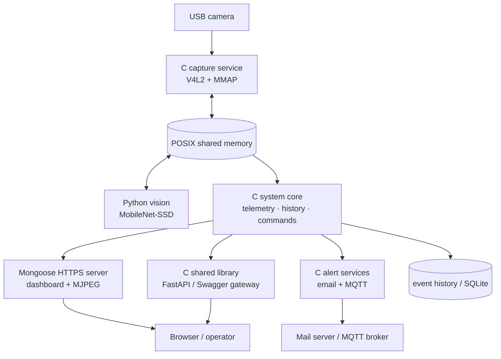
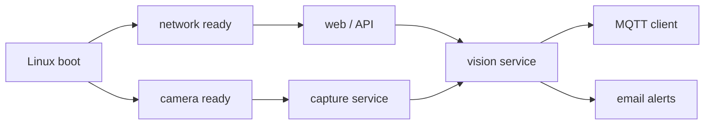

# Intelligent Guard System

<p align="center">
  Embedded Linux surveillance and monitoring for the Orange Pi Zero Plus 2 H5
</p>

<p align="center">
  
  
  
  
  
</p>

An intelligent guard system that captures live video, detects people, monitors the host, records events, and reports activity through a secure dashboard, REST API, email, and MQTT. The project is designed as a set of recoverable Linux services that start automatically with the device.

System-level logic remains in **C**. Python is limited to computer vision and a thin FastAPI layer for OpenAPI/Swagger documentation.

> **Development status:** Active. Camera capture, shared-memory exchange, person detection, telemetry, MJPEG streaming, HTTPS, the C API, Swagger integration, and recent-event history form the current foundation. Alerting and advanced guard features are integrated as the project progresses.

## Table of contents

- [What the system does](#what-the-system-does)
- [Architecture](#architecture)
- [Technology and design choices](#technology-and-design-choices)
- [Repository layout](#repository-layout)
- [Getting started](#getting-started)
- [Configuration](#configuration)
- [API](#api)
- [Services and recovery](#services-and-recovery)
- [Security](#security)
- [Validation plan](#validation-plan)
- [Roadmap](#roadmap)

## What the system does

- Captures `640 × 480` YUYV video from a USB camera with V4L2 and MMAP.
- Detects people with MobileNet-SSD and overlays boxes, count, FPS, date/time, and student ID.
- Publishes the latest annotated frame as an MJPEG stream.
- Reads CPU temperature, free memory, and CPU load directly from Linux virtual filesystems in C.
- Exposes monitoring and control through an HTTPS dashboard and a versioned REST API.
- Shares frames and runtime state between C and Python through POSIX shared memory.
- Retains recent detections and supports a SQLite-backed event log for guard mode.
- Reports detections through email and MQTT, with debounce, QoS 1, and LWT behavior.
- Recovers from process crashes and camera stalls through systemd and a software watchdog.
- Reduces vision workload when the CPU exceeds configured thermal thresholds.

## Architecture



### Runtime data flow

1. The C capture service reads the camera and writes the newest YUYV frame to shared memory.
2. The vision process reads a stable frame, detects people, annotates it, and updates the shared state.
3. C modules expose the resulting image, count, telemetry, and history to the dashboard and API.
4. A detection can create an event, persist evidence, and trigger email/MQTT notifications.
5. systemd and the watchdog supervise the services; thermal management can lower FPS or resolution.

The frame sequence field prevents readers from consuming a buffer while it is being updated. Only the newest frame is streamed, so slow clients do not create an ever-growing backlog.

## Technology and design choices

| Area | Implementation | Reason |
| --- | --- | --- |
| Camera | C, V4L2, MMAP | Low-copy access to the Linux camera device |
| Inter-process data | POSIX shared memory | Fast local exchange without frame transport over sockets |
| Detection | Python, OpenCV, MobileNet-SSD | Lightweight inference on embedded hardware |
| Web server | C, Mongoose | Small native HTTP/HTTPS and MJPEG server |
| Core API | C shared library | Keeps telemetry, history, and command logic native |
| API documentation | FastAPI, Swagger, `ctypes` | Thin interactive gateway over the C library |
| Messaging | C, libmosquitto | MQTT QoS 1 publishing and Last Will support |
| Email | C | Native alert path with image attachments and debounce |
| Persistence | Recent-history store and SQLite | Fast recent lookup plus durable event records |
| Supervision | systemd | Boot startup, dependencies, restart, and logging |

## Repository layout

The repository is organized by responsibility rather than assignment section:

| Path | Purpose |
| --- | --- |
| `src/` | Native application modules: camera, web, API, telemetry, history, and shared state |
| `include/` | Public C headers matching the native modules |
| `python/vision/` | Detection pipeline and annotated-frame generation |
| `python/api/` | FastAPI/OpenAPI gateway that calls `libguard_api.so` |
| `html/` | Dashboard assets and the latest published image |
| `configs/` | Runtime settings and feature switches |
| `cert/` | Local TLS certificate and key; private keys must not be committed |
| `models/` | MobileNet-SSD model files |
| `services/` | systemd unit definitions, when installed on the target |
| `docs/` | Architecture notes, experiment results, screenshots, and report assets |
| `third_party/` | Vendored dependencies such as Mongoose and cJSON |
| `build/` | Generated binaries and shared libraries; not source-controlled |

Key build outputs:

- `build/guard-system` — native application
- `build/libguard_api.so` — C API loaded by the FastAPI layer

## Getting started

### Requirements

- Orange Pi Zero Plus 2 H5 or a Linux development machine
- Linux camera exposed as `/dev/video*`
- C compiler, CMake, and Make
- OpenSSL development files
- Python 3 with OpenCV, NumPy, FastAPI, and Uvicorn
- Mosquitto development files for MQTT features
- SQLite development files for persistent guard events

### Build

After cloning the repository:

```bash
cmake -S . -B build
cmake --build build --parallel
```

Run the native application during development:

```bash
./build/guard-system
```

Production deployment uses systemd rather than manually launched processes. See [Services and recovery](#services-and-recovery).

### Access

The default development endpoints are:

| Interface | URL |
| --- | --- |
| Secure dashboard | `https://<device-ip>:8443/` |
| HTTP redirect | `http://<device-ip>:8080/` |
| Swagger UI | `https://<device-ip>:8443/docs` |
| MJPEG stream | `https://<device-ip>:8443/stream` |

Because the device uses a self-signed certificate, a browser warning is expected until the certificate is trusted locally.

## Configuration

Primary runtime settings are stored in `configs/settings.json`:

```json
{
  "vision": {
    "jpeg_path": "html/live/latest.jpg",
    "jpeg_quality": 90
  },
  "camera": {
    "device": 1,
    "width": 640,
    "height": 480,
    "fps": 30
  }
}
```

Before running on a new device:

1. Confirm the camera index with `v4l2-ctl --list-devices`.
2. Set the camera device, resolution, and FPS in `configs/settings.json`.
3. Generate a self-signed certificate whose Common Name is the student ID.
4. Provide email and MQTT credentials through protected configuration or environment files.
5. Do not place passwords, API tokens, or private keys in source control.

## API

FastAPI documents the interface, but the underlying state, telemetry, history, and command operations are implemented in C and exposed through `libguard_api.so`.

| Method | Endpoint | Description |
| --- | --- | --- |
| `GET` | `/API/V1/STREAM` | Live MJPEG stream; Swagger may request a single JPEG frame |
| `GET` | `/API/V1/PERSONS` | Current person count and timestamp |
| `GET` | `/API/V1/TELEMETRY` | CPU temperature, free memory, and CPU usage |
| `GET` | `/API/V1/HISTORY` | Five most recent detection records |
| `POST` | `/API/V1/COMMAND` | Allow-listed device command, currently `reboot` |

Example telemetry response:

```json
{
  "cpu_temperature": 48.52,
  "free_memory_mb": 214,
  "cpu_usage": 37.25
}
```

Example command request:

```json
{
  "cmd": "reboot"
}
```

Telemetry is read directly in C from `/proc/stat`, `/proc/meminfo`, and `/sys/class/thermal/thermal_zone*/temp`; shell commands are not used for data collection.

## Services and recovery



Unit files use explicit `After=`/`Requires=` relationships and a restart policy so dependent processes start in the correct order and recover after failure.

Common operational commands:

```bash
sudo systemctl status guard-webserver.service
sudo systemctl restart guard-webserver.service
sudo journalctl -u guard-webserver.service -f
systemd-analyze blame
```

The software watchdog separately detects a stalled frame sequence. If no new frame arrives within the configured interval, it records the fault, sends a camera-tamper alert, and restarts the affected service.

## Security

- HTTPS-only application access with permanent HTTP-to-HTTPS redirection.
- Self-signed TLS certificate with the student ID as the certificate CN.
- Allow-listed command handling; arbitrary shell input is rejected.
- MQTT authentication enabled and anonymous access disabled.
- SSH root login disabled; key-based access is preferred.
- Secrets supplied outside the source tree with restrictive file permissions.
- Generic external error responses, with detailed diagnostics retained in the service journal.
- Services run with the minimum permissions required by their device and network roles.

## Validation plan

Results, plots, screenshots, and videos belong in `docs/` and the final report; the README provides the navigation layer.

| Area | Validation |
| --- | --- |
| Boot and recovery | Boot timing, automatic startup, forced-process restart, full power-cycle recovery |
| HTTPS | HTTP 301 redirect and certificate CN inspection |
| API | Live Swagger tests for every endpoint |
| Performance | Temperature under three workloads, five-minute memory trend, and 50 concurrent telemetry requests |
| Resilience | Two-minute network outage and reconnection |
| Detection | Accuracy under four lighting conditions, printed-image spoof test, and resolution trade-off |
| Messaging | MQTT LWT, broker recovery, end-to-end latency, and rejected anonymous connection |
| Guard features | Alarm flow, SQLite records, camera watchdog recovery, and adaptive thermal response |

## Roadmap

- [x] Modular C project foundation and CMake build
- [x] V4L2 capture and POSIX shared memory
- [x] MobileNet-SSD detection and annotated live frames
- [x] Native telemetry, HTTPS dashboard, and MJPEG stream
- [x] C API library with FastAPI/Swagger gateway
- [x] Recent detection history
- [ ] C email alerts with 30-second debounce
- [ ] C MQTT client with QoS 1, authentication, and LWT
- [ ] Guard-mode API, emergency topic, and SQLite black box
- [ ] Camera watchdog and automatic recovery evidence
- [ ] Adaptive thermal policy and performance experiments
- [ ] Final report, screenshots, plots, and demonstration videos

## Author

**Amin Feizi Shahri**  
M.Sc. Digital Systems — Sharif University of Technology

This repository is an academic embedded-systems project. Its self-signed TLS setup and demonstration control endpoint are intended for a trusted lab network; review the threat model before any real-world deployment.
